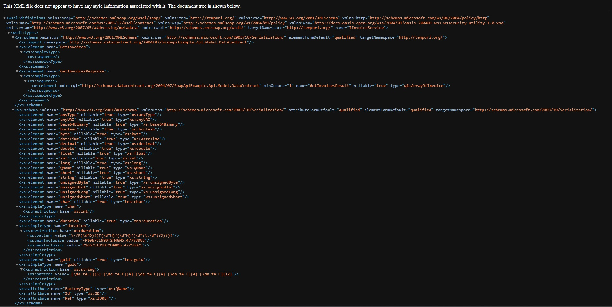
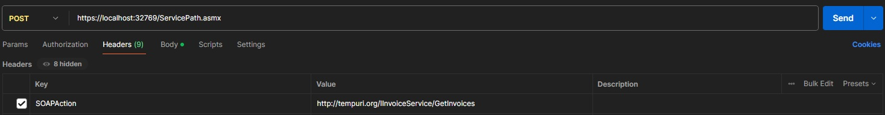
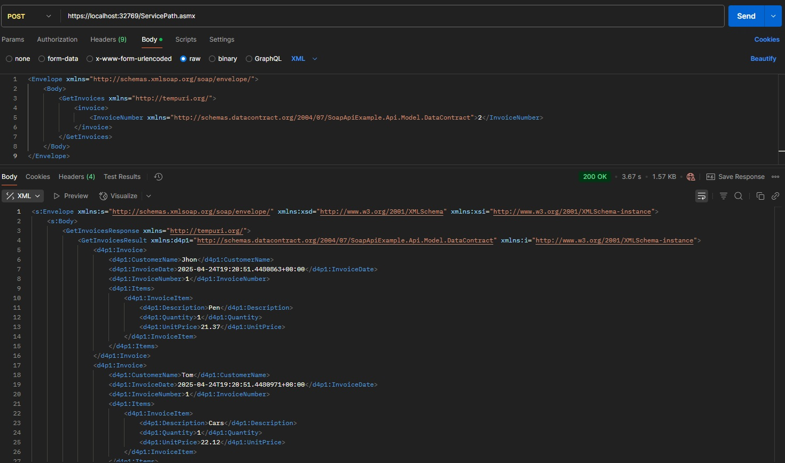

# About

This article is practical guide for anyone looking to set up and work with a SOAP API. It is based on my own experience, and aims to provide clear steps, useful tips, and highlight some of the common challenges I encountered along the way.
## Tools
For this tutorial we will be needing:
* .Net 8
* Postman
# Contents
- [About](#About)
- [Contents](#Contents)
- [What is SOAP API?]()
	- [Key Features]()
- [Project preconditions]()
- [Model]()
	- [DataContract example]()
	- [XMLSerialization example]()
- [Soap service]()
	- [Implementation]()
	- [Configuration]()
	- [What is WSDL?]()
	- [How to Read a WSDL?]()
- [How to Call a SOAP API?]()
	- [Postman example]()
- [Final words]()
# What is SOAP API?

SOAP API (Simple Object Access Protocol) is a **protocol** used to exchange  information between systems over a network using **HTTP**. It's one of the ways web services can communicate with each other, often used in enterprise applications.

## Key Features

* **Protocol-based** -  SOAP is a **standard protocol**, It follows strict rules defined by the W3C.
* **XML Format**
* **WSDL (Web Services Description Language)** - SOAP use **WSDL files** to describe the service – what operations it provides, input/output types, and how to access it.

# Project preconditions

Install SoapCore nuget package

	dotnet add package SoapCore

With this packed installed we are ready to create example model for our project.
# Model
For the sake of this article we will use basic model of Invoice.

In .NET, there are two primary approaches for serializing objects to XML: **DataContractSerializer** and **XmlSerializer**. For new development, **DataContractSerializer** is generally recommended due to its superior performance, support for complex object graphs, and ability to serialize private members. However, in legacy systems or scenarios requiring strict adherence to specific XML schemas, **XmlSerializer** may be necessary, as it offers greater control over the XML output and is compatible with a broader range of existing XML standards. In this article, we will explore both serializers to understand their respective use cases and implementation details

## DataContract example

This example demonstrates how to implement **DataContract** and **DataMember** attributes for serializing objects in SOAP services using **DataContractSerializer**.
- **DataContract**: Applied to classes to indicate they are serializable. This tells the serializer which types should be included in the SOAP message.
- **DataMember**: Applied to class properties to mark them for serialization. Only properties marked with this attribute are included in the serialized XML.

```
[DataContract]
public class Invoice
{
	[DataMember]
	public required int InvoiceNumber { get; set; }
	[DataMember]
	public required string CustomerName { get; set; }
	[DataMember]
	public required DateTime InvoiceDate { get; set; }
	[DataMember]
	public ICollection<InvoiceItem> Items { get; set; } = new List<InvoiceItem>();
}
```

```
[DataContract]
public class InvoiceItem
{
	[DataMember]
	public string? Description { get; set; }
	[DataMember]
	public required int Quantity { get; set; }
	[DataMember]
	public required decimal UnitPrice { get; set; }
}
```

```
[DataContract]
public class GetInvoice
{
	[DataMember]
	public required int InvoiceNumber { get; set; }
}
```
## XMLSerialization example
For **XmlSerializer** situation is the same but we use **XmlType** and **XmlElement**:
- **XmlType**: Applied to classes to define the XML schema for the object. It marks the class as serializable to XML.
- **XmlElement**: Applied to class properties to specify which properties should be included in the serialized XML and how they should appear in the XML structure.

```
[XmlType]
public class XmlInvoice
{
	[XmlElement]
	public required int InvoiceNumber { get; set; }
	[XmlElement]
	public required string CustomerName { get; set; }
	[XmlElement]
	public required DateTime InvoiceDate { get; set; }
	[XmlElement]
	public ICollection<XmlInvoiceItem> Items { get; set; }
}
```

```
[XmlType]
public class XmlInvoiceItem
{
	[XmlElement]
	public string? Description { get; set; }
	[XmlElement]
	public required int Quantity { get; set; }
	[XmlElement]
	public required decimal UnitPrice { get; set; }
}
```

```
[XmlType]
public class GetXmlInvoice
{
	[XmlElement]
	public required int InvoiceNumber { get; set; }
}
```

# Soap service

With our model in place, we can proceed to implement the service. A service defines the methods that clients can invoke via SOAP. Each service consists of one or more **OperationContracts**, which represent operations exposed to remote clients.
## Implementation

Implementing a SOAP service in .NET is straightforward. First, we import the **System.ServiceModel** namespace. Then, we define an interface decorated with the **ServiceContract** attribute, and annotate each method intended for remote access with the **OperationContract** attribute.

Example 
```
using System.ServiceModel;

[ServiceContract]
public interface IInvoiceService
{
	[OperationContract]
	public IEnumerable<Invoice> GetInvoices(GetInvoice invoice);
}
```

When we have interface ready all we need to do is implement this interface. 

```
public class InvoiceService : IInvoiceService
{
	public IEnumerable<Invoice> GetInvoices(GetInvoice invoice)
	{
		return [ 
			new Invoice() 
			{
				CustomerName = "Jhon",
				InvoiceDate = DateTime.Now,
				InvoiceNumber = 1,
				Items = [ 
					new InvoiceItem() 
					{
						Description = "Pen",
						Quantity = 1,
						UnitPrice = 21.37M
					}
				]
			},
			new Invoice()
			{
				CustomerName = "Tom",
				InvoiceDate = DateTime.Now,
				InvoiceNumber = 1,
				Items = [
					new InvoiceItem()
					{
						Description = "Cars",
						Quantity = 1,
						UnitPrice = 22.12M
					}
				]
			}
		];
	}
}
```

## Configuration

Now that our SOAP service is ready, the next step is to register it in the ASP.NET application. First we need to register our service to dependency injection (DI) container. Then we need to add endpoint to our service.

During endpoint registration, we need to configure two key properties: **SoapSerializer** and **Path**.
- **SoapSerializer**: This should be set according to the serialization method used—either **DataContractSerializer** or **XmlSerializer**.
- **Path**: This specifies the URL path where the service will be accessible. For example, if we set the **Path** to `"/XmlServicePath.asmx"`, the service can be accessed at `https://localhost/XmlServicePath.asmx`.

```
var builder = WebApplication.CreateBuilder(args);

builder.Services.AddSoapCore();
builder.Services.AddSingleton<IInvoiceService, InvoiceService>();
builder.Services.AddSingleton<IXmlInvoiceService, XmlInvoiceService>();

var app = builder.Build();

app.UseRouting();

app.UseEndpoints(endpoints => {
    _ = endpoints.UseSoapEndpoint<IXmlInvoiceService>(opt =>
    {
        opt.Path = "/XmlServicePath.asmx";
        // Set SoapSerializer to XmlSerializer when using XmlSerializer
        opt.SoapSerializer = SoapSerializer.XmlSerializer;
    });
    _ = endpoints.UseSoapEndpoint<IInvoiceService>(opt =>
    {
        opt.Path = "/ServicePath.asmx";
        // Set SoapSerializer to DataContractSerializer when using DataContractSerializer
        opt.SoapSerializer = SoapSerializer.DataContractSerializer;
    });
});
```

With the service set up, we can now launch the application. Open a web browser and navigate to your application's base URL, appending `/XmlServicePath.asmx` or `/ServicePath.asmx` to access the SOAP endpoint. If everything is configured correctly, you should see a page displaying the service description.


This is WSDL

## What is WSDL?

**WSDL** (Web Services Description Language) is an **XML-based document** that describes a **SOAP web service**—including its operations, location (endpoint), and the communication protocols it uses.
## How to Read a WSDL?

WSDL files can be read manually, but using tools can make the process easier and more intuitive. Personally, I recommend the [Wizdler](https://chromewebstore.google.com/detail/wizdler/oebpmncolmhiapingjaagmapififiakb) Chrome extension. It's lightweight and provides a clear overview of the service structure and required inputs. However, many other tools are available to help you inspect and interact with WSDL files, depending on your preferences and development environment.

# How to Call a SOAP API?

Calling a SOAP API is straightforward. First, add the required HTTP headers:
- **SOAPAction**: Set this to the specific action you want to call, e.g., `http://tempuri.org/IMyService/GetUser`
- **Content-Type**: Set this to `text/xml; charset=utf-8`

Next, construct the request body. A SOAP message must be wrapped in a SOAP **Envelope**, which includes a **Header** (optional) and a **Body** (required). Here's a basic example:

```
<soapenv:Envelope xmlns:soapenv="http://schemas.xmlsoap.org/soap/envelope/" xmlns:tem="http://tempuri.org/">
   <soapenv:Header/>
   <soapenv:Body>
	{{Your conntent here}}
   </soapenv:Body>
</soapenv:Envelope>
```
This Envelope structure is mandatory for every SOAP request.

To test our service we need to make following call.
```
POST /MyService.svc HTTP/1.1
Host: https://localhost:32769/ServicePath.asmx
Content-Type: text/xml; charset=utf-8
SOAPAction: "http://tempuri.org/IMyService/GetUser"

<soapenv:Envelope xmlns:soapenv="http://schemas.xmlsoap.org/soap/envelope/" xmlns:tem="http://tempuri.org/">
   <soapenv:Header/>
   <soapenv:Body>
      <tem:GetUser>
         <tem:userId>123</tem:userId>
      </tem:GetUser>
   </soapenv:Body>
</soapenv:Envelope>
```

## Postman example





# Final words
That concludes this article. You should now be equipped to set up your own SOAP API. If you have any questions or notice any mistakes, please feel free to leave a comment. Best of luck, and enjoy working on your implementation!

Link to my implementation -> https://github.com/TheWerou/SoapCoreExample

# Links
1. https://github.com/DigDes/SoapCore
2. https://stackoverflow.com/questions/4123590/serialize-an-object-to-xml
3. https://medium.com/@duncan.osindi/create-soap-web-service-in-dotnet-core-4df801261484